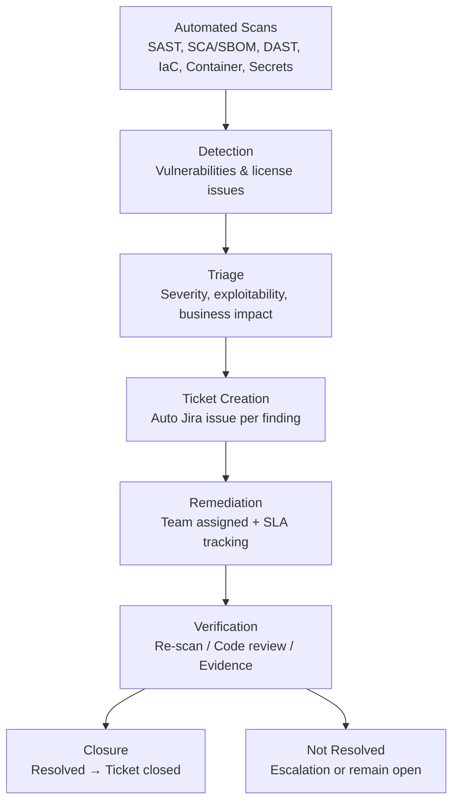
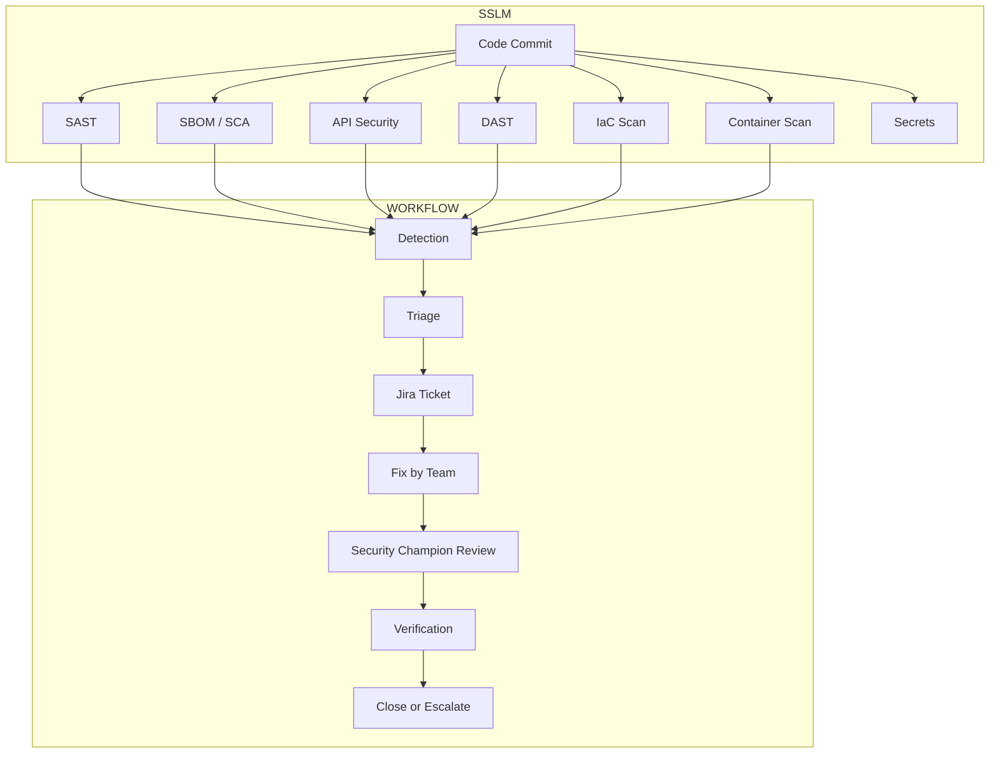
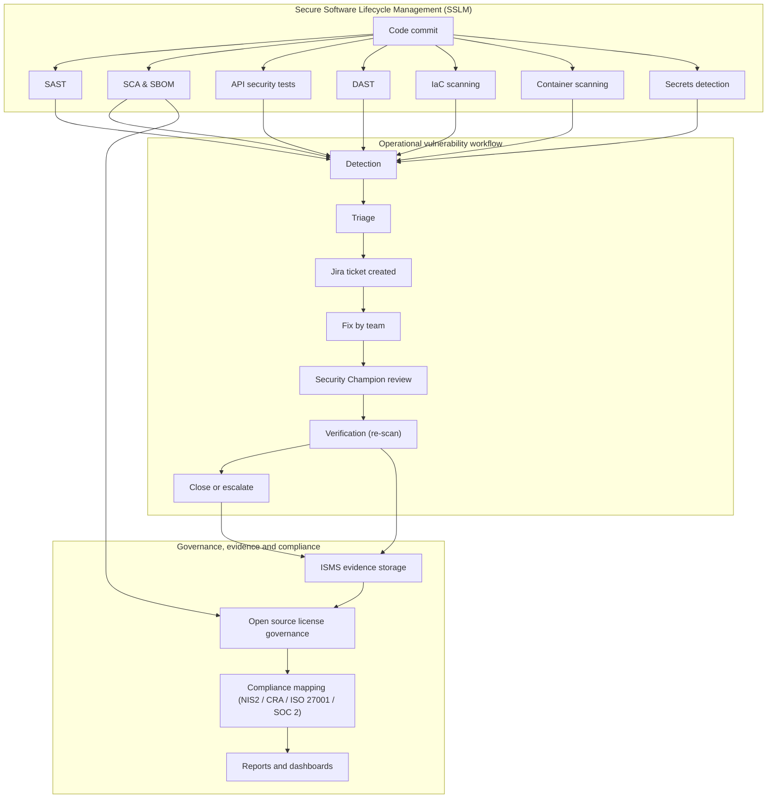
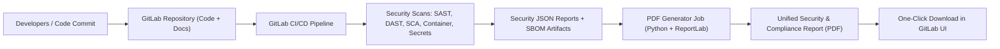
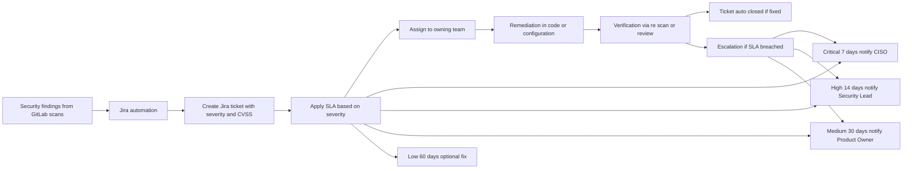
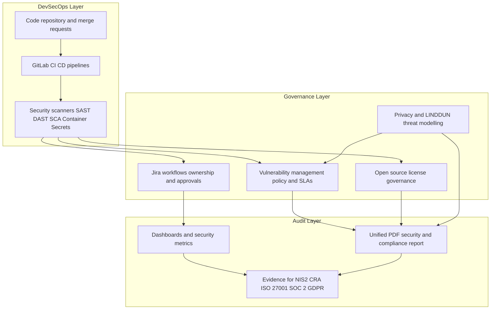
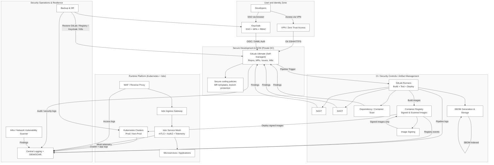
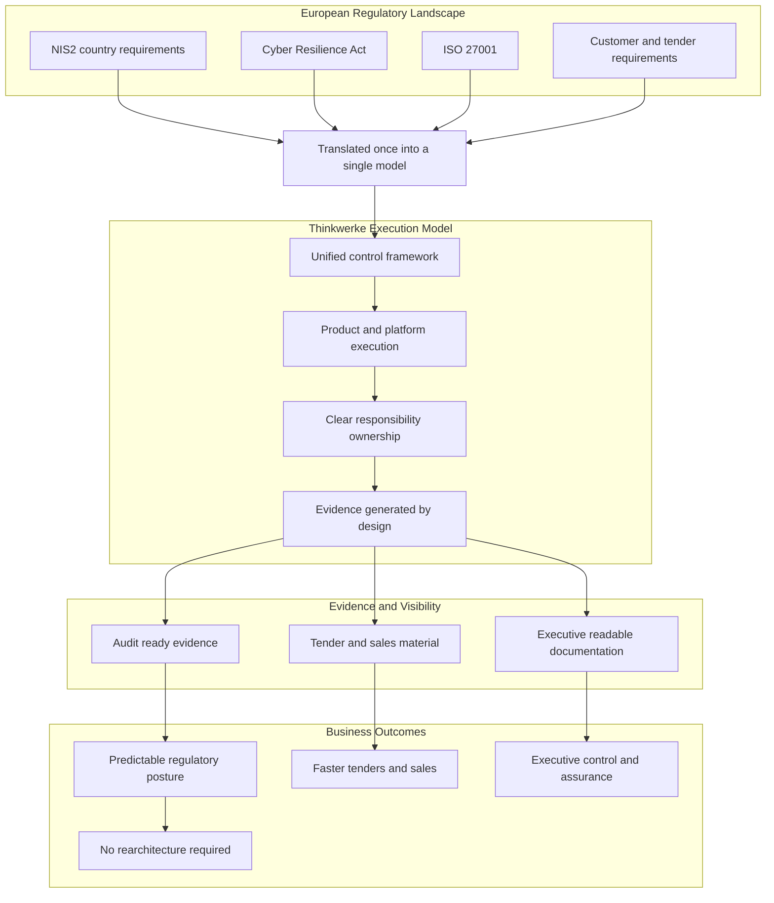

ThinkWerke
===========

ThinkWerke is where **strategy meets security** combining regulatory expertise, engineering depth, and implementation experience to help organisations build compliant, resilient, and scalable digital ecosystems.

We bring proven capability across **ISO 27001 implementation**, **EU Compliance & Governance (NIS2, DORA, AI Act, DATA Act, CRA readiness)**, **GRC framework design**, and **DevSecOps enablement** delivering secure-by-design architectures and operational governance that withstand regulatory scrutiny and business change.

Our team has hands-on experience in developing and automating security controls, audit evidence workflows, and CI/CD pipelines, integrating compliance directly into development and operations.  
From **governance and risk assessments** to **technical deployment and reporting automation**, we turn complex regulatory requirements into measurable, operational outcomes.

We are prepared to demonstrate our approach and toolchain in action.  
If your requirements are listed or scoped, **ThinkWerke can provide a live demo** of how NIS2, ISO 27001, and DevSecOps controls align seamlessly within your environment.

By uniting governance, engineering, and automation, ThinkWerke helps businesses **reduce risk, accelerate delivery, and earn lasting customer trust** ensuring that security and compliance become embedded strengths, not external constraints.

Cloud-Native Security and Application Assurance
===============================================

In collaboration with **Security Mind**, ThinkWerke integrates advanced cloud and application security capabilities 
across the full development and operations lifecycle. Our joint approach combines strategy, tooling, and automation to 
deliver continuous compliance, threat visibility, and secure-by-design environments.

**Cloud-Native Application Protection Platform (CNAPP)**  
CNAPP provides unified visibility and protection across workloads, containers, and cloud infrastructure.  
Through this framework, we consolidate CSPM, CWPP, and CIEM capabilities to:

  - Detect and remediate misconfigurations and vulnerabilities across hybrid cloud assets  
  - Enforce least-privilege and identity-based access policies  
  - Integrate runtime security into CI/CD and infrastructure pipelines  
  - Continuously assess compliance against ISO 27001, NIS2, and CRA-aligned controls  

**Cloud Security Posture Management (CSPM)**  
CSPM ensures that cloud environments remain secure and compliant by design.  
Our implementation approach leverages automated policy checks, drift detection, and guardrails that:

  - Prevent misconfigurations across AWS, Azure 
  - Continuously monitor compliance baselines and detect deviations  
  - Provide board-level reporting through real-time dashboards and evidence generation  

Application Security Posture Management (ASPM)
==============================================

**Security Mind**, developed in collaboration with ThinkWerke, is an AI-driven, multi-agent system 
purpose-built to enhance **Application Security Posture Management (ASPM)**.  
It unifies vulnerability triage, compliance monitoring, and code assurance within the software 
development lifecycle (SDLC), embedding security intelligence directly into DevSecOps workflows.

Built on advanced AI architectures, Security Mind leverages collaborative agents — for compliance, 
threat detection, and remediation — to automate key security functions, reduce manual overhead, 
and accelerate secure delivery across cloud and application environments.

**Core Capabilities**
---------------------

- **Multi-Agent Architecture:** Specialized agents coordinate across domains such as vulnerability triage, 
  license compliance, threat modeling, and cloud posture assessment.  
- **Integration-Friendly:** Connects seamlessly with Jira, GitHub, and major cloud APIs ( AWS, Azure).  
- **AI-Enabled Insight:** Uses large language models (LLMs) for natural language queries, policy interpretation, 
  and automated threat modeling.  
- **Continuous Assurance:** Correlates SAST, DAST, and dependency findings across build, deploy, and runtime stages 
  to provide unified application security visibility.  
- **Compliance Alignment:** Generates audit-ready reports mapped to **ISO/IEC 27001**, **NIS2**, **CRA**, and **AI Act** controls, 
  supporting secure development for regulated industries.  
- **Workflow Automation:** Automatically creates remediation tasks or Jira tickets for vulnerabilities, 
  license issues, and policy deviations.  

**Operational Features**
------------------------

- **Security Posture Reporting:** Real-time summaries of access management, vulnerabilities, and control coverage.  
- **CVE & Dependency Triage:** AI-assisted analysis of vulnerabilities, their exploitability, and mitigations.  
- **Policy Intelligence:** Interprets and summarizes internal policies, including open-source and SLA requirements.  
- **Code Review Automation:** Performs AI-based code and PR reviews for security flaws, code quality, and best practices.  
- **Cloud Resource Auditing:** Assesses GCP, AWS, and Azure environments for misconfigurations and IAM risk.  
- **Threat Modeling:** Generates structured assessments using frameworks like STRIDE to identify design-level risks.  

**Extensibility & Future Roadmap**
----------------------------------

Security Mind is fully extensible — organisations can add custom agents, integrate CI/CD hooks, 
or connect with GRC and SIEM tools.  
Planned enhancements include AWS/Azure full support, ML-driven anomaly detection, and enterprise dashboards.

Together, **ThinkWerke and Security Mind** deliver an ASPM solution that combines **AI intelligence, automation, 
and governance alignment** — enabling continuous assurance from code to cloud.

Link - AI Powered ASPM - https://github.com/jitendar-singh/securitymind

